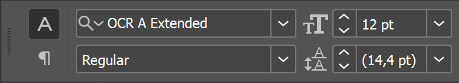
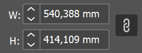
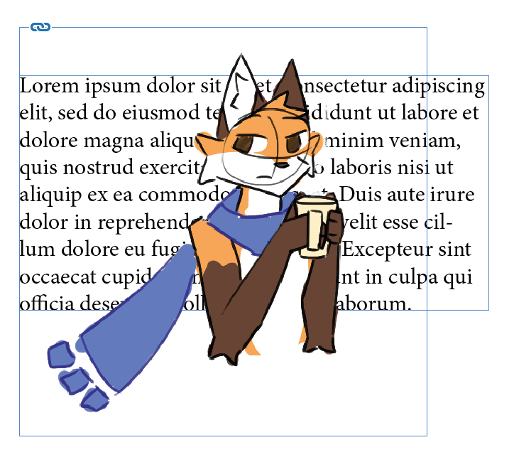

# InDesign útmutató

<!-- TODO: tegyük hozzá hogy életemben nem tördeltem még teljes számot xdddddddddddd -->

<!-- TODO: reorder -->

## Ez is csak egy Adobe slop...

### Projektek

<!-- TODO 
nem ezzel kezdeném hanem 
-->

### A felület

Ha először nyitjuk meg az InDesignt, akkor ez a munkaterület fogad minket. Mielőtt elmondanék bármit is róla, állítsuk át egy kicsit részletesebbre.
A fejlécen az Essentials feliratra kattintva válasszuk ki az Advanced nézetet.

!!! note "A workspacekről"
    A többi Adobe programhoz hasonlóan itt is vannak előre definiált munkaterületek, és itt is hasonló módon személyre tudjuk szabni az elrendezést és az előbeállításokat. Ha elrontanánk valamit, akkor ugyan ebben a legördülő menüben tudjuk visszaállítani az alapértelmezésre. A workspacek panelekből (avagy tab groupokból) és tabokból állnak, ezek elrendezését és viselkedését egyesével tudjuk állítani. Javaslom, hogy játszadozz el vele egy kicsit (ha már van egy megszokott elrendezésed, akkor esetleg mentsd el előtte xd), a későbiekben nagyon hasznos lesz. 

Az Advanced nézet sem tökéletes, hiányzik pár alapvető dolok, ezeket a `Window` menüből tudjuk elővenni. 
Ezek elsőre lehet, hogy lebegő ablakokban jelennek meg, ha szeretnénk, a legtöbb dolgok hozzá tudjuk adni (csak odahúzod) a paneljeinkhez, hogy legközelebb kéznél legyenek.

> Az útmutató során esélyes, hogy olyan paneleket fogok használni, amik nem/másképp szerepelnek alapból. Ne ijedj meg, minden elérhető a `Window` menüben, és nem baj ha más az elrendezésed, ez ízlés kérdése.

#### Nagy vonalakban

Legfelül a menük, alatta az eszköz specifikus vezérlő panel, bal oldalt az eszközök, középen a dokumentum, jobb oldalt különféle panelek találhatók.

### Alap billentyűkombinációk

Az Adobe programok egyik legnagyobb átka, hogy eltér minden eddig megszokott program legalapvetőbb gyorsbillentyűitől.

- ++space+right-button++: ha nyomva tartod tudod vele mozgazni a dokumentumot
- ++alt++ + görgő: nagyítás és kicsinyítés
- görgő: függőleges tekerés
- ++ctrl++ + görgő: vízszintes tekerés
- ++ctrl+z++: visszavonás
- ++ctrl+shift+z++: újra

Nem kell minden gyorsbillentyűt tudni kívülről, később a nagy részét amúgy is meg fogod tanulni, de fel fogom majd tűntetni őket, és ha valamilyen eszköz főlé viszed az egeredet is mutatja. Ha nagyon akarod, az `Edit > Keyboard Shortcuts` menüben lehet állítani.

## Alap koncepciók

### Oldalak és oldalpárok

Egy InDesign dokumentum oldalakból áll. 
Mi általában kötött/tűzött dokumentumokat készítünk, ezért többnyire oldalpárokban gondolkodunk, mint pl. egy nyitott könyvnél.
Az ezzel kapcsolatos dolgok a `Pages` tabon érhetők el.

{height=360}

A `+` ikonnal tudunk hozzáadni új oldalakat.
Láthatjuk, hogy 3 oldalunk és 2 oldalpárunk van.
A furcsa elrendezés azért van, mert az első oldalunk - a borító - külön áll.

<!-- 
TODO: facing pages, document setup stb.
TODO: parents
- section markers
TODO: master page, shift ctrl katt hogy lehessen editelni? 
-->

Minden oldalpárhoz tartozik körülötte lelógó hely (pasteboard).

Ami lelóg, vagy nincs rajta az oldalon, az nem fog megjelenni nyomtatásban, de a szerkesztéskor hasznos lehet, ha pl. még nem találod valaminek a helyét. Ha látni szeretnéd, hogy mi fog ténylegesen megjelenni, akkor ++w++-vel tudsz a normal és a preview nézetek között váltani (vagy van neki gomb az eszköztár alján). 

<!-- TODO: move this -->
!!! note "Kapcsolódó menük"
    -  `File > Document Setup`: dokumentum bállítások, méretek, margók, előlap 

<!-- TODO: bleed (kifutó), margins -->

### Rétegek és keretek

Ahogyan a legtöbb kreatív program, az InDesign is rétegeket használ. 

{height=360}

A rétegeink tartalmaznak minden elemet, amit létrehozunk (szöveg, kép stb.).
Segítségükkel tudjuk rendszerezni a dokumentumunkat, és könnyen kezelhetjük az egymásra lógó elemeket: 
felsőbb réteg elemei a dokumentumon is felül lesznek, és kitakarják, ami alattuk van.

Új réteget a `+` gombbal tudunk hozzáadni, dupla kattintással át tudjuk nevezni.
A színes négyzetekre kattintva tudunk egész rétegeket, vagy elemeket kijelölni. 
Ha egyszerre több elemet szeretnénk, azt a ++shift++-tel tudjuk megtenni.
Fontos, hogy csak azokat az elemeket fogjuk látni a rétegeken, amik a kijelölt oldalon/oldalpáron vannak.
(Oldalpárt kijelölni dupla kattintással a `Pages` tabon, vagy csak simán a nézeten rákattintva lehet.)

<!-- TODO: csoportosítás -->

### Gizmók

<!-- TODO
v, a 
legfelső réteg elemeinek prio kijelölésnél, ctrl kattintással a mögötte lévőt is lehet

módosítók: shift, alt, ctrl mit csinálnak 
-->

## Szöveg

<!-- TODO: szövegkeret beállítások, belső margók -->

Ahogy a legtöbb elem, a szövegek is keretekben/dobozokban vannak.
Hozzonk létre egy szövegdobozt a `Type Tool`-lal (++t++), és húzzunk vele egy téglalapot a dokumentumon.

??? tip "Lorem ipsum"
    A [Lorem Ipsum](https://en.wikipedia.org/wiki/Lorem_ipsum) egy klasszikus helyőrző szöveg, amit gyakran használunk, ha nincs még kész szövegünk, vagy gyorsan kell valami a helyére.
    Ez az InDesignba be van építve, a `Type > Fill with Placeholder Text`  menüponttal (jobb klikk menüből is elérhető) generál nekünk latin szöveget.

Ha túl sok a szöveg egy szövegdobozban, akkor az InDesign panaszkodni fog, ezt mutatja a piros `+` jel a jobb alsó sarokban.

{height=360}

Ha duplán kattintunk az alul középen lévő fogantyúra, akkor automatikusan átméretezi a keretet akkorára, hogy a szöveg elférjen.

Ezt persze nem tehetjük meg mindig, van hogy a szöveget több szövegdobozon át szeretnénk elosztani. Ilyenkor a piros `+` jelre kattintva megfogja a szöveg kilógó részét, és áthúzhatjuk egy másik szövegdobozra, vagy létrehozhatunk egy újat ha üres helyre kattintunk vele.

> Erről sajnos nem tudok jó képet mutatni, mert a képernyőképek nem mutatják az egeremet.

Hasonló módon nem csak a szöveg végét, hanem a szöveg elejét is meg tudjuk fogni és átrakni, a bal felső sarokban felülről a második fogantyúval.

<!-- TODO: cukorka: shift klikkel van auto text threading -->

### Betűk

!!! note "Tipográfia"
    A [tipográfia](https://hu.wikipedia.org/wiki/Tipogr%C3%A1fia) egy külön tudomány, a betűk és betűtípusok készítése és kezelése egy külön művészet. 
    Az ehhez tartozó jegyzetet [itt](typography.md) találod.

Ezt szeirintem nem kell különösebben részleteznem, a közoktatás mindenkibe beleverte a Word használatát.

A gyors beállításokat a felső sávon találjuk, a részleteket pedig a `Properties` panelen.

!!! note ""
    A szélső két gombbal tudunk váltani a betűket és a bekezdéseket érintő beállítások között.

Itt tudjuk továbbá beállítani a szöveg nyelvét is, ennek főként a szótagolásnál van jelentősége, de a helyesírás-ellenőrzés is figyelembe veszi.

### Bekezdések

<!-- TODO: paragraph styles -->

### Stílusok

TODO

#### Karakterstílusok

A karakterstílusok segítéségével gyorsan és konzisztensen tudunk szöveget formázni. 

!!! warning "Nem bekezdésstílus"
    Nem összetévesztendő a bekezdésstílusokkal, amikről mindjárt szó lesz.
    A karakterstílusok a szöveg egyes karaktereinek formázására szolgálnak, míg a bekezdésstílusok az egész bekezdésre vonatkoznak.

Azért célszerű stílusokat használni, ahelyett hogy egyesével formáznánk a szövegeket, egy egységes beállítást ad, megelőzi az inkonzisztenciát, és ha a későbbiekben változtatni szeretnénk, akkor csak a stílust kell módosítanunk, nem kell egyesével. 

!!! warning ""
    A stílusok használata kritikus nagyobb dokumentumoknál, és a csapatmunkánál. A konzisztens megjelenés elengedhetetlen, és ehhez a stílusok használata nagyban hozzájárul.

Vegyük elő a `Character Styles` panelt.

<!-- TODO -->

### Elrendezés

<!-- 
TODO:
csíkok/sorhoz igazítás (baseline grid, align to grid)
hasábok, magók
text frame options
keep options
-->

## Képek

Az InDesign külön kezeli a képeket és a képkereteket. 
A kép és a kerete külön mozgathatók.
A kép azon része, ami a kereten kívülre esik, nem fog látszani.

Képeket beszúrni drag&droppal vagy a `File > Place` ++ctrl+d++ menüből tudunk. 
Ha minden jól meg, ez fogad minket:

{height=360}

??? tip "A beszúrt képekről"
    Ha nagyobb képeket szúrunk be, akkor esélyes, hogy óriási méretűek lesznek, és emiatt nem látszódnak. Ilyenkor elég nagy macera tud lenni átméretezni őket, erre megoldás lehet kézzel beállítani a méretüket a felső sávban. Ügyeljünk a képarányra (lánc ikon)!

    

Az méretezés és a mozgatás irányítása a legkevésbé sem magától éretődő, és nekem is rengeteg fejfájás volt eleinte.

**Mozgatás:**

- A `Selection Tool`-lal (++v++) tudjuk mozgazni a képet és a keretet egyszerre.
    - Ha dupla kattintunk a képre, akkor megjelenik a kéz, és a kerettől függetlenül tudjuk mozgazni a képet.
    - Ezt a középső karika bigyusszal is meg tudjuk tenni: nyomvatartással tudjuk mozgazni a képet a kerettől függetlenül. 
- A `Direct Selection Tool`-lal (++a++) tudjuk mozgatni a képet a kerettől függetlenül.

{height=360}

Magyarázat:

- A réteg színével (itt kékkel) jelölt téglalap a képkeret.
- A barna téglalap a kép. 
- A képnek csak a képkereten belüli része lászik.

**Méretezés, vágás:**

- A `Selection Tool`-lal (++v++) tudjuk a keretet méretezni, de a kép **nem fog vele együtt mozogni**
    - Ha együttt szeretnénk méretezni a képet és a keretet, tartsuk nyomva a ++ctrl++-t és a kereten található fogantyúkkal méretezzük át.

Az különféle módosítók, mint a ++shift++ és az ++alt++, itt is működnek, ugyan úgy mint bármi más kijelölésnél.

!!! warning "Képarány"
    A ++shift++ különösen fontos, különben elcsúszhat a képarány.
    
    {width=360}

Nem túl fontos extrák:

- A sárga bigyusszal tudunk lekerekített sarkokat csinálni.
- A kék (rétegszínű) bigyusszal tudjuk a képet szöveghez kötni (és még sok mást).
- A láncra ++alt++ kattintva látjuk a linkeket.

!!! tip "Szabad formájú képkeretek"
    InDesignban is használhatunk szabad formájú képkereteket, nem csak téglalapokat. Ezt a `Pen Tool`lal tudjuk megtenni.
    Ha segít, úgy is gondolhatsz a keretre, mint egy maszkra. 

!!! question "Miért jó ez?"
    Tördeléskor gyakran előfordul, hogy a kép helye és mérete adott: ez a keret. Az viszont, hogy a kép melyik része látszik, mennyire van nagyítva, forgatva stb. viszont kevésbé kötött és akár változhat is a munka során. Így a keretünk tartja a helyet és méretet, a képet viszont tetszőlegesen mozgathatjuk benne, akár ki is cserélhetjük a képet.

### Körbefutás

Alapesetben ha egy képet szövegre rakunk, ez fogad minket:

{height=360}

Jelöljük ki a képet, és vegyük elő a `Text Wrap` panelt.
(Kevésbé részletes beállítások a felső sávban is elérhetők.)

{height=360}

A következő opciók érhetők el:

- `No Text Wrap`: nincs körbefutás
- `Wrap Around Bounding Box`: a képet befoglaló téglalap körül fussa körbe
- `Wrap Around Object Shape`: a kép tartalma körül fussa körbe
- `Jump Object`: a szöveg ugorja át a képet
- `Jump to Next Column`: a szöveg ugorjon át a következő hasábba

{height=360}

A befoglaló téglalap esetén külön megadhatunk margót a keret körül. Ezt a képen a kereten kívüli extra doboz jelöli, és látjuk, ahogy a szöveg tartja az margót.

{height=360}

A `Wrap Around Object Shape` esetén a szöveg a képt tényleges tartalma körül fog fog futni, de ehhez tudnunk kell a kép tartalmának alakját. Ezt elsőre az InDesign megpróbálja legenerálni, az esetek többségében egész jó, főleg ha teszünk rá margót. 

Ha mégse lenne jó, akkor a `Contour Options` alatt választhatunk másik módszert, amivel kitalálja a széleit. Az `Alpha Channel` opció egész jól szokott működni.

Van olyan is persze, hogy pár kóbor pixel a képen elrontja vagy csak buta az algoritmus, ilyenkor a `Pen Tool` segítségével kézzel is szerkeszthetjük a körvonalat. 

<!-- TODO: gányolás extra formákkal admonition -> csoportosítás -->
<!-- TODO: szétcsúszó szöveg, egy szavas sorok -->
<!-- TODO: ignore text wrap pl oldalszámhoz -->

### Linkek

A beszúrt képek nem kerülnek bele a dokumentumba, csak egy hivatkozás van rájuk, ami a fájl helyére mutat. Ezt a `Links` panelen látjuk.

Ha ki szeretnénk cserélni a képet úgy, hogy a keretét megőrizzük, a `Relink`-re (a lánc ikon, balról a második) kattintva ki tudjuk választani az új képet.

{height=360}

??? tip "Ha változik az eredeti kép..."

    Ha megváltozik az eredeti kép (fájl), az InDesign problémázhat, hogy nem stimmel. 

    {height=360}

    A :warning:-ra kattintva (vagy a `Links` panelen dupla kattintással) tudjuk kijavítani.

<!-- 
TODOs és jegyzet

vonalzók és segédvonalak

színek, paletták, színterek, cmyk

templatek, design libraryk

oldalszám

csapatmunka, egységesítés, irányelvek, book

szótagolás, nyelvek, autocorrect?

preflight ellenőrzés

hq előnézet

shift w, presentation mode

ctrl f grep

exportálás

karakterszám újraszámolás képek alapján, esetleg ehhez egy googledocs template?

megjelenítés minősége

actual könyvnyomtatási szabályok/irányelvek/tördelés finomságai és kerülendő dolgok, szégyenfal

tartalomjegyzék rework, indent

spellcheck ctrl i

bevett szokások impulzusnál
- rétegek 
    - előtér
    - munkaterület: szöveg
    - háttér
- meg kéne csinálni a kifutót a templatekben
- régi pdf-ek alapján az export és hasonló finomságok ha van benne
- karakterstílus
- bekezdéstílus
    - jaaa
    - interjú kérdés tesz maga elé üres sort (elém???)
    - aláírás cikk után?
    - aláírás alá képekhez
        - spotot nem szoktuk megjelölni, ők ott vannak az elején
- kép, körbefolyás
    - felső layer, vagy háttér
    - szögletesnél 3mm
- mappa szervezés, együttműködés a többiekkel (esetleg kérdezzem meg)
- drive tördelős mappa
- egyszerre tördelés, lock
 -->