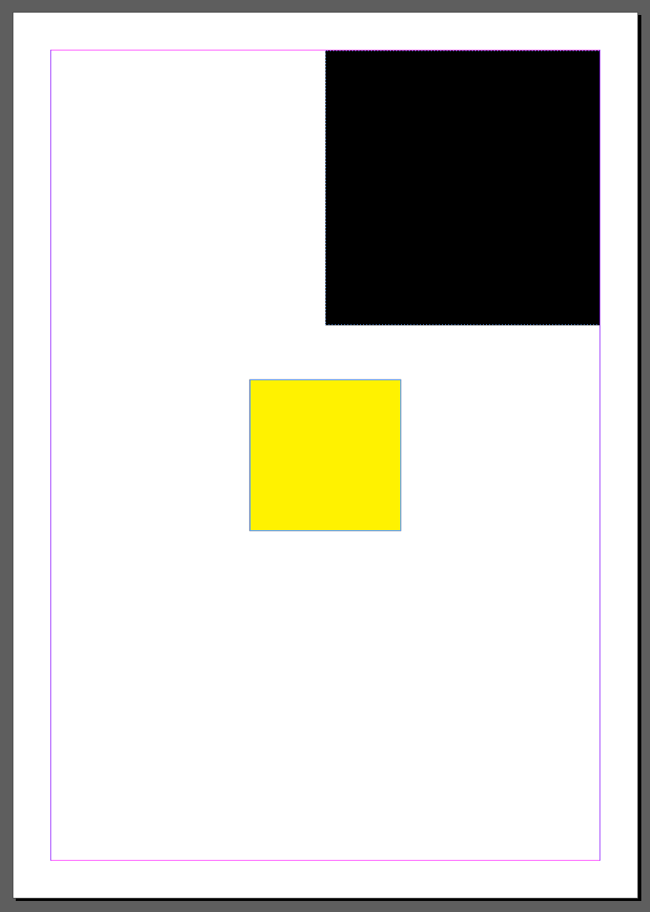
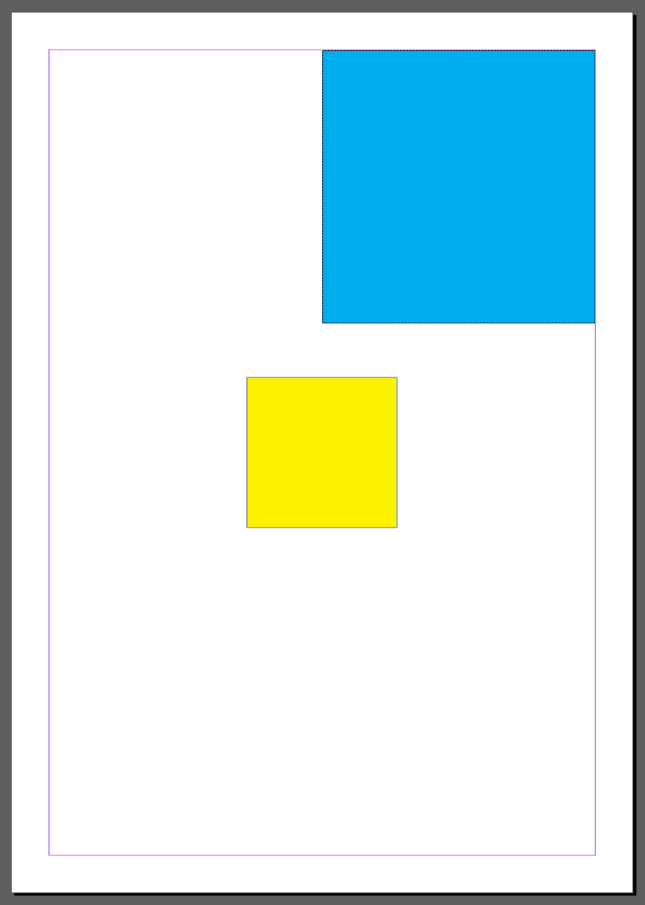
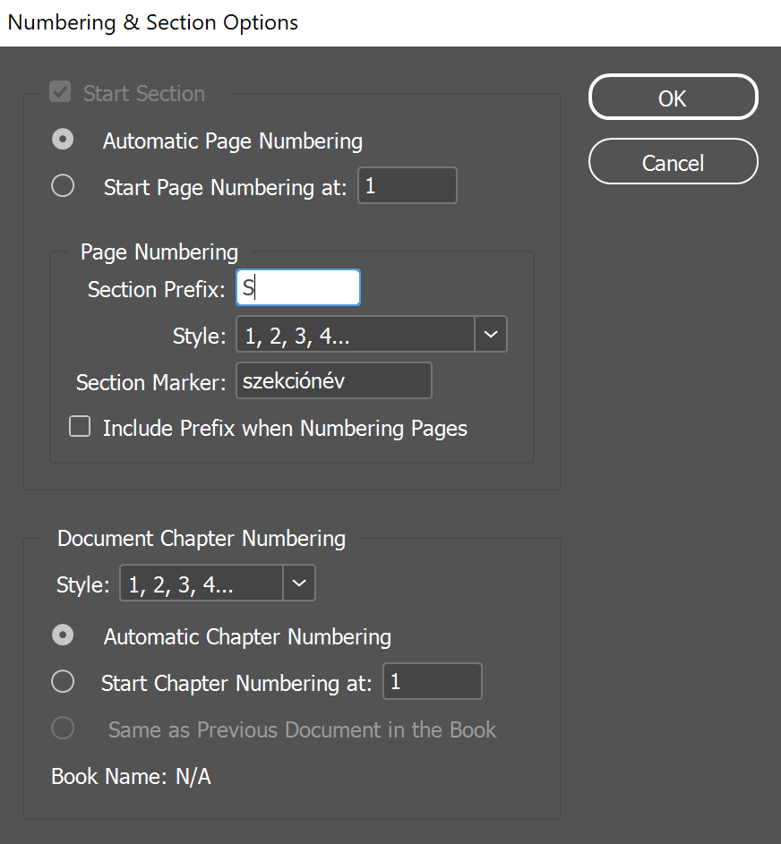

# InDesign alapok

> Ez is csak egy Adobe slop...

## Projektek

Ez fogad minket elsőre, itt tudunk új dokumentumot létrehozni. 

Részletesebb beállításokat a `More Presets` alatt találunk. Nekünk egyelőre elég az alap A4-es.

## A felület

Ha először nyitjuk meg az InDesignt, akkor ez a munkaterület fogad minket. Mielőtt elmondanék bármit is róla, állítsuk át egy kicsit részletesebbre.
A fejlécen az `Essentials` feliratra kattintva válasszuk ki az `Advanced` nézetet.

!!! note "A workspacekről"
    A többi Adobe programhoz hasonlóan itt is vannak előre definiált munkaterületek, és itt is hasonló módon személyre tudjuk szabni az elrendezést és az előbeállításokat. Ha elrontanánk valamit, akkor ugyanebben a legördülő menüben tudjuk visszaállítani az alapértelmezésre. A workspacek panelekből (avagy tab groupokból) és tabokból állnak, ezek elrendezését és viselkedését egyesével tudjuk állítani. Javaslom, hogy játszadozz el vele egy kicsit (ha már van egy megszokott elrendezésed, akkor esetleg mentsd el előtte xd), a későbbiekben nagyon hasznos lesz. 

Az Advanced nézet sem tökéletes, hiányzik pár alapvető dolog, ezeket a `Window` menüből tudjuk elővenni. 
Ezek elsőre lehet, hogy lebegő ablakokban jelennek meg, ha szeretnénk, a legtöbb dolgot hozzá tudjuk adni (csak odahúzod) a paneljeinkhez, hogy legközelebb kéznél legyenek.

!!! question ""
    Az útmutató során esélyes, hogy olyan paneleket fogok használni, amik nem/másképp szerepelnek alapból. Ne ijedj meg, minden elérhető a `Window` menüben, és nem baj, ha más az elrendezésed, ez ízlés kérdése.

### Nagy vonalakban

Legfelül a menük, alatta az eszköz specifikus vezérlő panel (felső sáv), bal oldalt az eszközök, középen a dokumentum, jobb oldalt különféle panelek találhatók.

## Alap billentyűkombinációk

Az Adobe programok egyik legnagyobb átka, hogy eltér minden eddig megszokott program legalapvetőbb gyorsbillentyűitől.

- ++space++ + bal egérgomb: ha nyomva tartod, akkor tudod vele mozgatni a dokumentumot
- ++alt++ + görgő: nagyítás és kicsinyítés
- görgő: függőleges tekerés
- ++ctrl++ + görgő: vízszintes tekerés
- ++ctrl+z++: visszavonás
- ++ctrl+shift+z++: újra

Nem kell minden gyorsbillentyűt tudni kívülről, később a nagy részét amúgy is meg fogod tanulni, de fel fogom majd tüntetni őket, és ha valamilyen eszköz fölé viszed az egeredet, akkor is mutatni szokta, menüpontokban írja. Ha nagyon akarod, az `Edit > Keyboard Shortcuts` menüben lehet állítani.

# Alap koncepciók

## Objektumok

A legtöbb dolgot objektumnak tekinthetjük, legyen az szövegdoboz, képkeret, vonal vagy egyéb forma.

Szúrjunk be egy téglalapot a `Rectangle Tool`-lal (++m++).

{height=360}

Az objektumainkat a `Selection Tool`-lal (++v++) tudjuk kijelölni, mozgatni, átméretezni, forgatni stb.
Kijelöléshez kattintsunk az objektumra. 
Húzással vagy a ++ctrl++ nyomvatartásával kijelölhetünk akár többet is egyszerre.
(Mivel üres a téglalapunk belseje, ezért ezt a kereténél vagy a középső bigyusznál fogva tudjuk mozgatni.)

!!! tip "Kijelölés"
    Átlapolódás esetén a legfelső réteg elemeit fogja kiválasztani, de ha ++ctrl++-t nyomvatartva kattintunk, akkor a mögötte lévő elemet fogja kiválasztani, ha még egyszer kattintunk, akkor az azalatt lévőt, és így tovább.

A `Direct Selection Tool`-lal (++a++) tudjuk az objektumunk egyes pontjait mozgazni. 
Például a téglalapunk esetén kiválaszthatunk pontokat és szabadon mozgathatjuk őket.

{height=360}
{height=360}

!!! tip "A módosítóbillenytűk általánosságban"
    A módosítóbillentyűk a legtöbb objektumnál ugyanúgy viselkednek.

    - ++shift++: méretezésnél tartja az arányokat, mozgatásnál csak vízszintesen, függőlegesen és átlósan enged mozgatni, forgatásnál 45 fokos lépésekben forgat
    - ++alt++: méretezésnél a középpontból méretez, ha nyomva tartjuk és úgy mozgatunk valamit, akkor lemásolja az objektumot
    - ++ctrl++: nyomvatartva több elemet is kijelölhetünk vele egyszerre

## Rétegek és keretek

Ahogyan a legtöbb kreatív program, az InDesign is rétegeket használ. 

{height=360}

A rétegeink tartalmaznak minden elemet, amit létrehozunk (szöveg, kép stb.).
Segítségükkel tudjuk rendszerezni a dokumentumunkat, és könnyen kezelhetjük az egymásra lógó elemeket: 
felsőbb réteg elemei a dokumentumon is felül lesznek, és kitakarják, ami alattuk van.

Új réteget a `+` gombbal tudunk hozzáadni, dupla kattintással át tudjuk nevezni.
A színes négyzetekre kattintva tudunk egész rétegeket, vagy elemeket kijelölni. 
Ha egyszerre több elemet szeretnénk, azt a ++shift++-tel tudjuk megtenni.
Fontos, hogy csak azokat az elemeket fogjuk látni a rétegeken, amik a kijelölt oldalon/oldalpáron vannak.
(Oldalpárt kijelölni dupla kattintással a `Pages` tabon, vagy csak simán a nézeten rákattintva lehet.)

### Csoportok

Rétegeken belül tovább csoportosíthatjuk az elemeket. Jelöljük ki csoportosítani kívánt elemeket, majd a `Object > Group` menüponttal (++ctrl+g++) egyesítsük őket egy csoportba.

### Lezárás

Rétegeket, csoportokat és objektumokat is le tudunk zárni.
Ennek hatására nem tudjuk kijelölni vagy módosítani őket, amíg fel nem oldjuk őket.
Háttereket, fix dolgokat érdemes lezárni, nehogy véletlenül őket mozdítsuk el vagy jelöljük ki.

Lezárni a szem melletti rublikába kattintva tudunk.

{width=360}

## Oldalak és oldalpárok

Egy InDesign dokumentum oldalakból áll. 
Mi általában kötött/tűzött dokumentumokat készítünk, ezért többnyire oldalpárokban gondolkodunk.
Az ezzel kapcsolatos dolgok a `Pages` tabon érhetők el.

{height=360}

A `+` ikonnal tudunk hozzáadni új oldalakat.
A furcsa elrendezés azért van, mert az első oldalunk - a borító - külön áll.

Minden oldalpárhoz tartozik körülötte lelógó hely (pasteboard).

Ami lelóg, vagy nincs rajta az oldalon, az nem fog megjelenni nyomtatásban, de a szerkesztéskor hasznos lehet, ha pl. még nem találod valaminek a helyét. 

!!! tip "Előnézetek"
    Ha látni szeretnéd, hogy mi fog ténylegesen megjelenni mindenféle gizmó és segédvonal nélkül, akkor ++w++-vel tudsz a normál és az előnézet között váltani. Ha még tovább szeretnéd vinni, akkor létezik a `Presentation Mode` (++shift+w++).
    A képek és grafkikák nem mindig jelennek meg a legjobb minőségükben. Ez azért van, hogy ne robbanjon fel a géped nagyobb dokumentumoknál. A `View > Display Performance` menüpontban tudod beállítani a megjelenési minőséget. Ne felejtsd el visszaállítani :smiley:.

### Mester oldalak

Segítségükkel egységes elrendezést és megjelenést adhatsz több oldalnak egyszerre.
Ha módosítod a mester oldalt, az ezt használó összes oldal tartalma frissülni fog.

Kattintsunk a `Pages` tabon duplán az `A-Parent`-re, ekkor fogjuk látni és tudjuk szerkeszteni a mester oldalunkat. 
A bal és jobb oldalak megjelenését értelemszerűen külön tudjuk kezelni, ez a legtöbb esetben csak tükrözést jelent az elrendezésben, de a lehetőségek száma végtelen.

{height=360}

Szemléltetésképp felvettem két fekete négyzetet. 
Menjünk vissza a tényleges oldalunkra (dupla kattintás az első oldalra).
Ha minden igaz az oldalunk követi az `A-Parent`-et, így a két fekete négyzetnek itt is meg kell jelennie.
Ha mégsem követné, vagy meg akarjuk változtatni, akkor a megfelelő `Parent` ráhúzásával be tudjuk állítani.

{height=180} {height=180}

Az ábrákon láthatjuk, hogy miután rákerült a minta, megjelenik egy kis ikon a sarokban, ami jelzi, hogy melyik mester oldalt követi. A kis ikon nagyon jól kitakarja, de látszik alatta a fekete négyzet is, amit ráraktam.

??? example "Demonstráció"
    A tényleges oldalon felvettem egy sárga négyzetet.

    {height=200}

    Ezután visszamentem a mester oldalra, átszíneztem a fekete négyzeteket kékre. Vegyük észre, hogy a sárga négyzet nincs itt.

    {height=200}

    Visszamentem az első oldalra. A sárga négyzet érintetlenül marad, de a fekete négyzet bekékült, hiszen az a mester oldalról származott.

    {height=200}

Ha valamit módosítani szeretnénk az oldalunkon, ami egy mester oldal részét képezi, elsőre nem fog menni.
Alapból a mester oldal elemei védettek, a ++ctrl+shift++ kattintásal tudjuk feloldani őket.

!!! danger "A feloldás mellékhatásai"
    Ha feloldunk egy elemet a mester oldalról, az később nem fog frissülni a mester oldal szerkesztésekor, ezért ezt csak indokolt esetben használjuk. Ha minden oldalon oldalon feloldunk egy elemet a mestertől, akkor esélyes, hogy valamit rosszul csinálunk.

!!! question "Mit rakhatok egy mester oldalra?"
    Valójában bármit, a jobb kérdés az lenne, hogy **mit érdemes**. 
    
    - **Makrókat**. Ilyen például az oldalszám vagy a fejezetcím. Ezeket a `Type > Text Variables > Insert Variable` és a `Type > Insert Special Character` menüpontokból tudjuk beszúrni.
    - **Képkereteket**. Elég csak a keretet létrehozni, a tartalmát pedig az oldalon tudjuk majd beállítani feloldás nélkül.
    - Szöveget, fenntartásokkal. Amit lehet, igyekezzünk makróval. A szövegkeret tartalmának szerkesztéséhez fel kell oldani azt az elemet, elvész a kapcsolat a mester oldallal, viszont a szövegstílust megtartja. Szövegstílusokról később lesz szó.

Új mester oldalhoz jobb klikkeljünk egy meglévőre, és válasszuk a `New Parent` menüpontot.

{height=360}

Itt beállíthatunk neki egy prefixet és egy nevet, sőt, akár egy meglévő mester oldalból is örökölhetünk elemeket.
Ilyenkor az ős elemeit átveszi, és újabb elemeket vehetünk fel rá. Ha az őst szerkesztjük, mind a belőle származó mester oldalak, mind a mintát használó oldalak frissülni fognak.

??? question "Mire jó ez?"
    Tegyük fel, hogy van egy oldalszámot tartalmazó mester oldalunk, ebből származtathatunk pl. egy szöveges oldalt, egy képes oldalt stb. Ha későb szeretnénk változtatni az oldalszám kinézetén, akkor elég lesz csak az ős mester oldalt szerkeszteni, és mindenhol frissülni fog.

### Fejezetek

Mint ahogy azt említettem, tudunk makrókat beszúrni a mester oldalakra, például fejezetcímeket.

A mester oldalunkon szúrjuk be a fejezetcímünket a `Type > Insert Special Character > Markers > Section Marker` menüponttal.
A beszúrt szöveget ízlés szerint formázhatjuk, a tényleges fejezetcímünk is követni fogja majd.

{height=360}

Elvileg még nem kéne látnunk semmit, hiszen még nem állítottuk be a fejezeteket és azok címeit. Ezeket a `Pages` oldalon a jobb klikk `Numbering & Section Options` ablakban találjuk.

{height=360} {height=180} {height=360}

## Dokumentum beállítások

A `File > Document Setup` (++ctrl+alt+p++) ablakban érjük el a dokumentumunk beállításait.

{height=360}

Itt tudjuk beállítani a dokumentum kezdőoldalát, terjedelmét, a méretet és a margókat.
A `Facing Pages` állítja, hogy oldalpárokat használunk-e, vagy sem. 
Ha lenyitjuk, előjönnek a `Bleed` és a `Slug` beállítások is.

!!! danger "Kifutó"
    A kifutó (`Bleed`) a papír szélén túlnyúló rész. A nyomdák miatt van rá szükség, nem mindig tudják pontosan vágni a papírt, így a mérete is nyomdafüggő. Ha pl. egy képet a lap szélére teszünk, de nem fut ki a kifutóig, akkor vágásnál lehet, hogy egy fehér csíkot is kapunk ajándékba mellé. Ez persze nem néz ki szépen, így mindenképpen húzzunk ki minden lap szélét érintő képet és grafikát a kifutó széléig. Arra is ügyeljünk, hogy lényegi része a képnek ne kerüljön a kifutóba, ha tökéletesen vágnák is nézzen ki jól. Az előnézet (++w++) sokat tud segíteni ebben is, nem mutatja a kifutó részt.

## Színek

A legtöbb objektum színe állítható, pl. a kijelölés után a felső sávból is.
A színeket a `Colours` panelen érjük el. 
Ez elsőre valószínűleg CMYK színmódban lesz, de a hamburger menüben át tudjuk állítani, a legkönnyebben értelmezhető talán a HSB.

{width=360}

!!! danger "A színskálán kívül"
    A nyomtatók CMYK-ban nyomtatnak, ha nem ebben a színtérben választunk színt, megvan az esélye, hogy nem kinyomtatható színt keverünk. Szerencsére az InDesign figyelmeztet, fel is ajánlja a hozzá legközelebb eső színt, ami még belefér. Kattintsunk rá, hogy kiválasszuk.

    {width=360}

### Színminták

Definiálhatunk előre megadott színeket, ún. színmintákat. Ha ezekkel színezünk, akkor később egységesen tudjuk módosítani az adott szín összes előfordulását a dokumentumban. Segítségükkel könnyen tudunk kezelni színpalettákat, és nagyban hozzájárulnak a dokumentumunk egységes kinézetéhez.

A színmintákat a `Swatches` panelen érhetjük el.

{height=360}

A felső 4 szín alapbeállítás, a többit ajándékba kaptuk... nem túl szépek, nyugodtan törölhetjük őket.

- `None`: teljesen átlátszó, üres szín, nem fehér. Hasznos ha pl. csak keretet szeretnénk egy alakzatnak, de a belsejét nem akarjuk kitölteni.
- `[Black]`: nem meglepő módon ez csak fekete.

!!! warning "`[Paper]`"
    Ezt az egy alapbeállítást tudjuk állítani, megváltoztatja **minden** papír színét. Nem ajánlott állítgatni, hacsak nem **fixen minden** oldalunk színes lesz. Ha csak egy-egy oldalt szeretnénk átszínezni, akkor inkább tegyünk be egy nagy téglalapot a háttérbe, és zároljuk.

!!! danger "`[Registration]`"
    Ezt a színt **SOHA NE HASZNÁLD**. Ez egy speciális szín, minden tintából a maximumot használja, nem úgy, mint a fekete. Szerkesztés közben cselesen ugyanolyan feketének fog látszani, de ez nyomtatáskor problémát okozhat.

!!! warning "Színminták használata"
    Nagyobb projektnél sose használj egyedi kikevert színeket! Mindenképp legyen neki egy színminta, és mindenképpen adj neki egy beszédes nevet! Piros pont, ha csinálsz nekik mappákat is.

#### Árnyalatok

Ha kijelölünk egy színt, a hamburger menüben tudunk neki új árnyalatot létrehozni a `New Tint Swatch` menüponttal, majd be tudjuk állítani a kívánt árnyalatot. 
Azért hasznos, mert ha változik az eredeti szín, akkor az árnyalat is vele együtt fog változni.
Érdemes mappákba rendezni őket, segít kiigazodni, hogy melyik árnyalat melyik színhez tartozik.

## Könyv

Könyvek segítségével könnyedén tudunk több kisebb dokumentumot egyesíteni, és együtt kezelni őket.
Ez hasznos lehet, ha nagyobb projekten dolgozunk: több kisebb InDesign projektünk lesz, ezért egyszerre tudunk dolgozni különböző részeken, és később egybe tudjuk fogni őket.

A `File > New > Book` menüponttal tudunk új könyvet létrehozni, vagy az `Open` alatt betölteni egy meglévőt.
Ekkor előugrik egy kis ablak, ami a könyvünket reprezentálja.

Itt a `+` gombbal tudunk hozzáadni új dokumentumokat, a `-` gombbal törölni.
Az `Untitled-2` sorában a legelső kis ikonka jelzi a stílus forrást.
Minden dokumentum az ő stílusait fogja használni.
Ezt áttehetjük másik dokumentumra, ha a megfelelő dokumentum rublikájába kattintunk.
Az oda-vissza nyíllal tudjuk szinkronizálni a stílusainkat a kijelölt dokumentum és a stílus forrás között.

!!! tip "Oldalszámok"
    Ha nem állítunk be oldalszámokat, magától fogja megpróbálni kitalálni. Nem feltétlenül baj, mert sorba tudjuk őket rakni, de egy szebb megoldás, ha minden dokumentumunkban be van állítva, hogy honnan kezdődik és meddig tart.

!!! warning "Nyomtató gomb"
    **NE** a nyomtató gombbal nyomtasd ki a könyvet, lényegesen kevesebb beállítási lehetőséged van. Helyette a hamburger menüből elérhető `Export Book to PDF...`-et használd.
