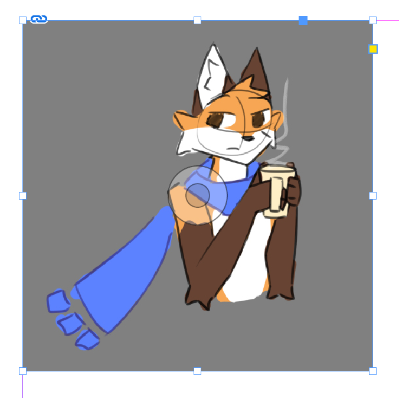
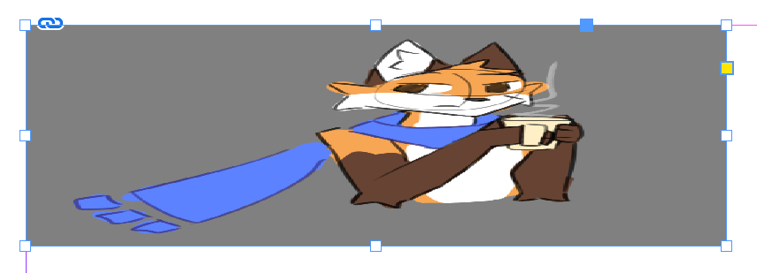
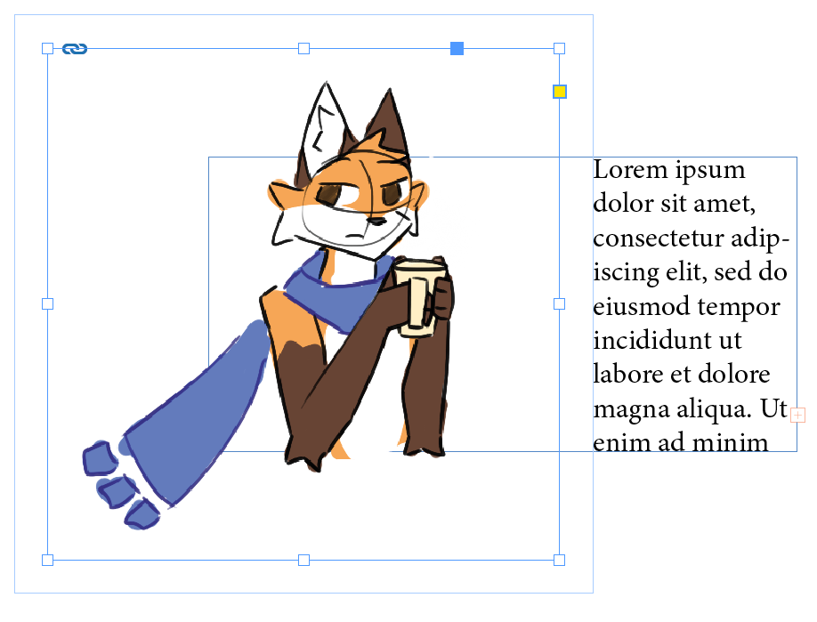
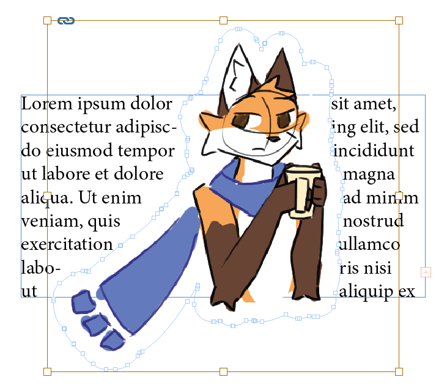
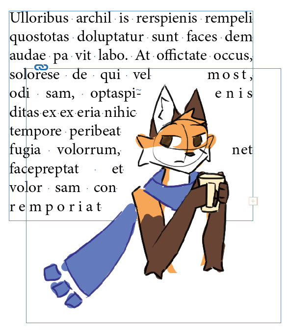
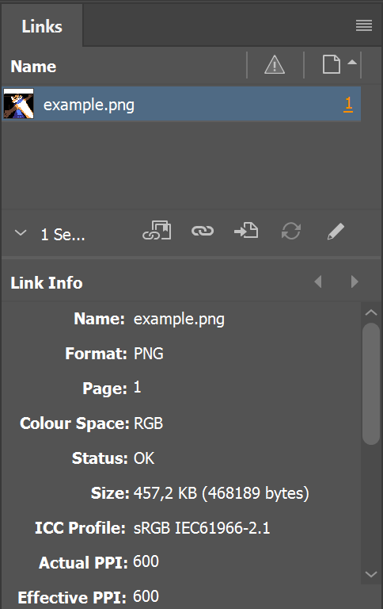
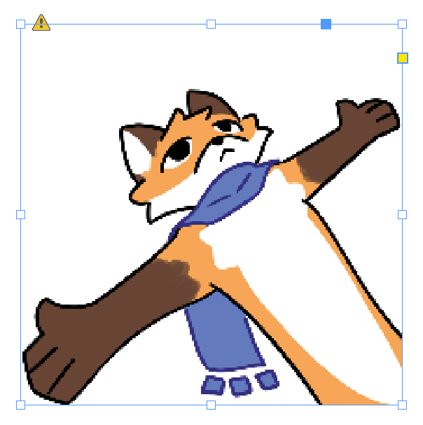

# Képek

Az InDesign külön kezeli a képeket és a képkereteket. 
A kép és a kerete külön mozgathatók.
A kép azon része, ami a kereten kívülre esik, nem fog látszani.

Képeket beszúrni drag&droppal vagy a `File > Place` ++ctrl+d++ menüből tudunk. 
Ha minden jól meg, ez fogad minket:

{height=360}

!!! tip ""
    Képek beszúrásakor, ha csak kattintunk, akkor eredeti méretben szúrja be a képeket, ha viszont húzunk vele egy téglalapot, akkor megspórolhatjuk magunknak a babrálást a gigantikus képekkel.
    (Ha nem látszik a kattintással beszúrt kép, az is lehet, hogy csak túl nagy.)

A méretezés és a mozgatás irányítása a legkevésbé sem magától értetődő, és nekem is rengeteg fejfájás volt eleinte.

**Mozgatás:**

- A `Selection Tool`-lal (++v++) tudjuk mozgatni a képet és a keretet egyszerre.
    - Ha dupla kattintunk a képre, akkor megjelenik a kéz, és a kerettől függetlenül tudjuk mozgazni a képet. Újabb dupla kattintásra visszavált normál működésre.
    - Ezt a középső karika bigyusszal is meg tudjuk tenni: nyomvatartással tudjuk mozgatni a képet a kerettől függetlenül. 
- A `Direct Selection Tool`-lal (++a++) tudjuk mozgatni a képet a kerettől függetlenül.

{height=360}

Magyarázat:

- A réteg színével (itt kékkel) jelölt téglalap a képkeret.
- A barna téglalap a kép. 
- A képnek csak a képkereten belüli része lászik.

**Méretezés, vágás:**

- A `Selection Tool`-lal (++v++) tudjuk a keretet méretezni, de a kép **nem fog vele együtt mozogni**
    - Ha együtt szeretnénk méretezni a képet és a keretet, tartsuk nyomva a ++ctrl++-t és a kereten található fogantyúkkal méretezzük át.

Az különféle módosítók, mint a ++shift++ és az ++alt++, itt is működnek, ugyanúgy mint bármilyen más kijelölésnél.

!!! tip ""
    ++ctrl+shift++: kép és keret méretezése együtt, tartva a képarányt.

??? warning "Képarány"
    A ++shift++ különösen fontos, különben elcsúszhat a képarány.
    
    {width=360}

A felső sávban különböző hasznos gombokat találunk, a tooltipek segítenek. Az `Auto-Fit` különösen hasznos lehet, automatikusan a kerethez igazítja a képet.

Nem túl fontos extrák:

- A sárga bigyusszal tudunk lekerekített sarkokat csinálni.
- A kék (rétegszínű) bigyusszal tudjuk a képet szöveghez kötni (és még sok mást).
- A láncra ++alt++ kattintva látjuk a linkeket.

!!! tip "Szabad formájú képkeretek"
    InDesignban is használhatunk szabad formájú képkereteket, nem csak téglalapokat. Ezt a [`Pen Tool`](extras.md#pen-tool)lal tudjuk megtenni.
    Ha segít, úgy is gondolhatsz a keretre, mint egy maszkra. 

!!! question "Miért jó külön kezelni a keretet?"
    Tördeléskor gyakran előfordul, hogy a kép helye és mérete adott: ez a keret. Hogy a kép melyik része látszik, mennyire van nagyítva, forgatva stb. viszont már kevésbé kötött, és változhat is a munka során. Így a keretünk tartja a helyet és méretet, a képet viszont tetszőlegesen mozgathatjuk benne, akár ki is cserélhetjük.

## Körbefutás

Ha egy képet szövegre rakunk, alapesetben ez fogad minket:

{height=360}

Jelöljük ki a képet, és vegyük elő a `Text Wrap` panelt.
(Kevésbé részletes beállítások a felső sávban is elérhetők.)

{height=360}

A következő opciók érhetők el:

- `No Text Wrap`: nincs körbefutás
- `Wrap Around Bounding Box`: a képet befoglaló téglalap körül fussa körbe
- `Wrap Around Object Shape`: a kép tartalma körül fussa körbe
- `Jump Object`: a szöveg ugorja át a képet
- `Jump to Next Column`: a szöveg ugorjon át a következő hasábba

{height=360}

A befoglaló téglalap esetén külön megadhatunk margót a keret körül. Ezt a képen a kereten kívüli extra doboz jelöli. Láthatjuk, ahogy a szöveg tartja a margót.

{height=360}

A `Wrap Around Object Shape` esetén a szöveg a képet tényleges tartalma körül fog futni, de ehhez tudnunk kell a kép tartalmának alakját. Ezt elsőre az InDesign megpróbálja legenerálni, az esetek többségében ez egész jó, főleg ha teszünk rá margót.

{height=360} {height=360}

Ha mégse lenne jó, akkor a `Contour Options` alatt választhatunk másik módszert, amivel kitalálja a széleit. Az `Alpha Channel` opció egész jól szokott működni.

Persze előfordul, hogy pár kóbor pixel elrontja, vagy csak buta az algoritmus, ilyenkor a [`Pen Tool`](extras.md#pen-tool) segítségével kézzel is szerkeszthetjük a körvonalat.

!!! example "Ha nagyon nem akarunk a `Pen Tool`-lal bíbelődni..."
    Egy elég gányolós megoldás, de működhet: beszúrunk pár láthatatlan alakzatot, és beállítjuk a körbefutást.
    **Ezt csak indokolt eseben használjuk, és mindenképp csináljunk belőlük és a képből egy csoportot (++ctrl+g++)!**

!!! danger "S z é l e s \_ s z a v a k"
    Elő tud fordulni körbefuttatott, sorkizárt szövegnél, hogy egyetlen szó kerülne egy sorba, és emiatt széthúzza a szöveget (pl. enis).

    {height=360}

    **Ilyet semmilyen körülmények között ne hagyjunk benne**, próbáljunk meg valamit kezdeni vele:

    - Játszadozunk a kép helyével, méretével, margójával. Olykor kis változtatások is drasztikus hatással vannak a szövegre.
    - `No Break` karakterstílust használunk (ha nincs ilyen, akkor létrehozzuk, `Basic Character Formats` alatt `No Break`-et nyomjuk be).
    - Egyéb gányolós megoldások, de ezeket kerüljük.

### Ignore Text Wrap

Nem mindig akarjuk persze, hogy a szöveg körbefussa a képet, de a körbefuttatás kikapcsolása nem mindig opció.
Ilyen esetekre van az `Ignore Text Wrap` beállítás a `Text Frame Options > General` (++ctrl+b+++) ablakban találunk.
Ez különösen jó például oldalszámoknál, ha rálóg egy képre, és azt a képet futja körbe a szövegtörzs, de egyéb művészien elhelyezett szövegeknél is hasznos lehet.

## Linkek

A beszúrt képek nem kerülnek bele a dokumentumba, csak egy hivatkozás van rájuk, ami a fájl helyére mutat. Ezt a `Links` panelen látjuk.

Ha ki szeretnénk cserélni a képet úgy, hogy a keretét megőrizzük, a `Relink`-re (a lánc ikon, balról a második) kattintva ki tudjuk választani az új képet.

{height=360}

??? tip "Ha változik az eredeti kép..."

    Ha megváltozik az eredeti kép (fájl), az InDesign problémázhat, hogy nem stimmel.

    {height=360}

    A :warning:-ra kattintva (vagy a `Links` panelen dupla kattintással) tudjuk kijavítani.

