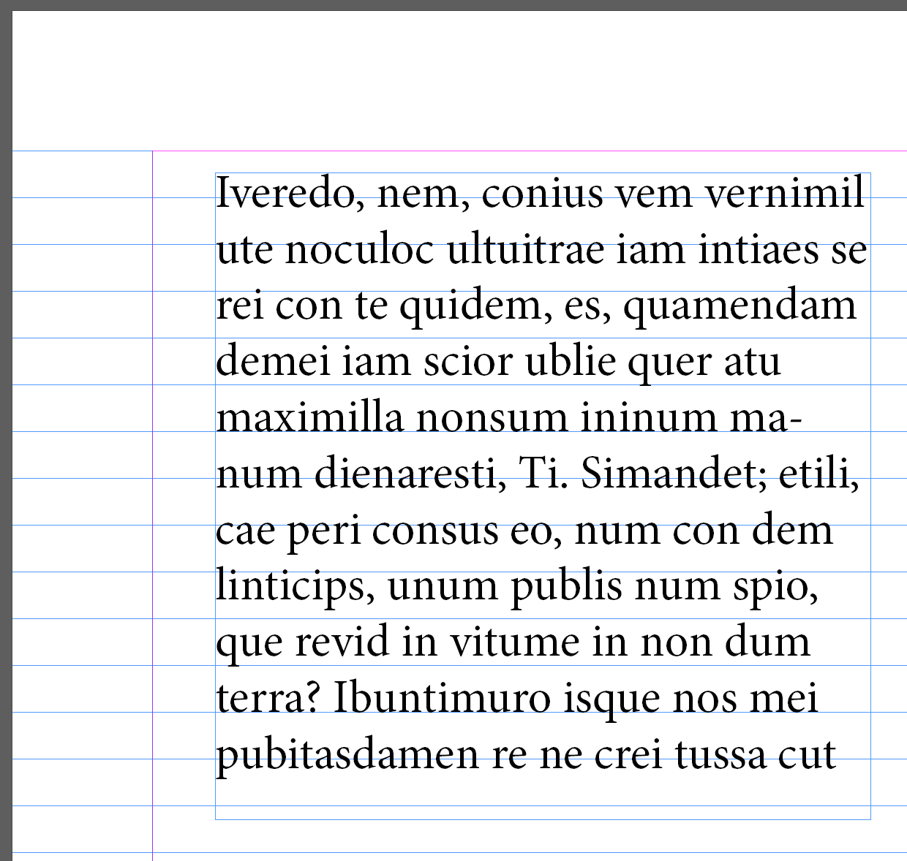
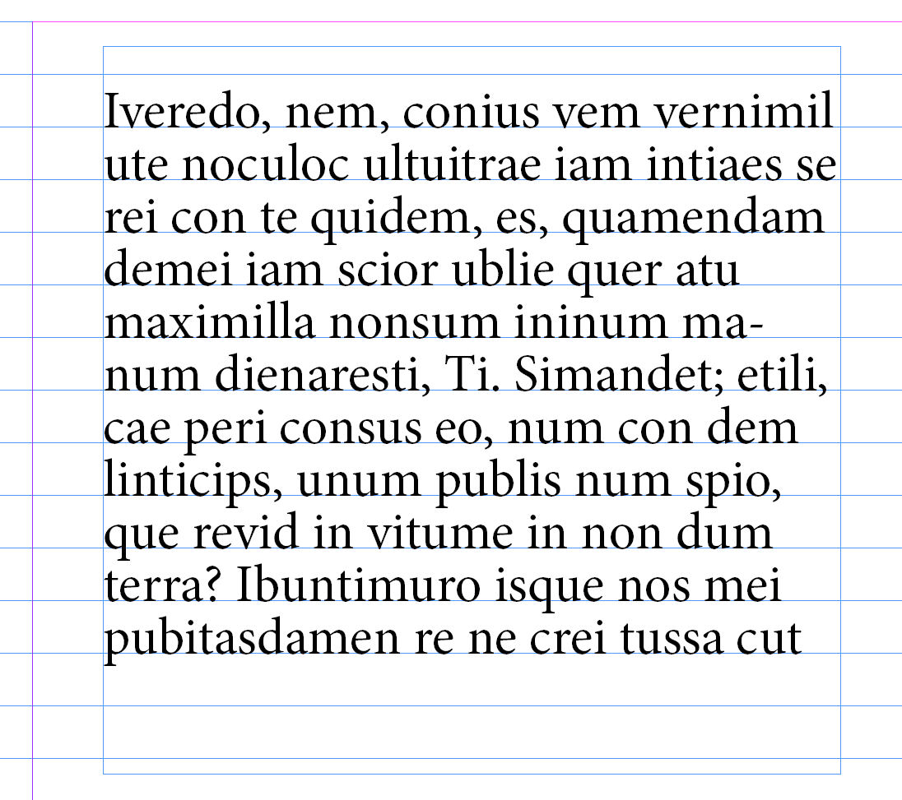

# Szöveg

Ahogy a legtöbb elem, a szövegek is keretekben/dobozokban vannak.
Hozzonk létre egy szövegdobozt a `Type Tool`-lal (++t++), és húzzunk vele egy téglalapot a dokumentumon.

??? tip "Lorem ipsum"
    A [Lorem Ipsum](https://en.wikipedia.org/wiki/Lorem_ipsum) egy klasszikus helyőrző szöveg, amit gyakran használunk, ha nincs még kész szövegünk, vagy gyorsan kell valami a helyére.
    Ez az InDesignba be van építve, a `Type > Fill with Placeholder Text`  menüponttal (jobb klikk menüből is elérhető) generál nekünk latin szöveget.

Ha túl sok a szöveg egy szövegdobozban, akkor az InDesign panaszkodni fog, ezt mutatja a piros `+` jel a jobb alsó sarokban.

{height=360}

Ha duplán kattintunk valamelyik szélső fogantyúra, akkor automatikusan átméretezi a keretet akkorára, hogy a szöveg elférjen.

Ezt persze nem tehetjük meg mindig, van hogy a szöveget több szövegdobozon át szeretnénk elosztani. Ilyenkor a piros `+` jelre kattintva megfogja a szöveg kilógó részét, és tovább húzhatjuk egy másik szövegdobozba, vagy létrehozhatunk egy újat, ha üres helyre kattintunk vele. Ez az ún. `Text Threading`.

Hasonló módon nem csak a szöveg végét, hanem a szöveg elejét is meg tudjuk fogni és átrakni, a bal felső sarokban felülről a második fogantyúval. Ha egy szövegdoboz nem lenne elég, és nem akarjuk egyesével csinálni, az ++alt++-ot nyomvatartva több szövegdobozra is kattinthatunk, ezeket sorban össze fogja kötni, és folyatni fogja bennük a szöveget.

## Betűk

!!! note "Tipográfia"
    A [tipográfia](https://hu.wikipedia.org/wiki/Tipogr%C3%A1fia) egy külön tudomány/művészet. Az ehhez tartozó jegyzetet [itt](../typography.md) találod.

Ezt szerintem nem kell különösebben részleteznem, a közoktatás mindenkibe beleverte a Word használatát.

A gyors beállításokat a felső sávon találjuk, a részleteket pedig a `Properties` panelen.

{width=360}

!!! note ""
    A szélső két gombbal tudunk váltani a betűket és a bekezdéseket érintő beállítások között.

Itt tudjuk továbbá beállítani a szöveg nyelvét is, ennek főként a szótagolásnál van jelentősége, de a helyesírás-ellenőrzés is figyelembe veszi.

## Bekezdések

A legtöbb beállítás itt is hasonló a Word-ös beállításokhoz, nem fogok mindent részletezni.

A gyors beállításokat ehhez is a felső sávon találjuk.

{width=360}

Itt viszont különösen javaslom a `Properties` panelt, mert sokkal több hasznos dolog van itt.

{height=360}

A hamburger menü további ínyencségeket rejt. Talán már túlságosan részletes, nagyon különleges esetekben van rá csak szükség szerencsére, ezért nem is térnék ki rájuk részletesen.

{width=360}

Viszont van további eldugott beállítások a szövegdobozokhoz: `Object > Text Frame Options...` (++ctrl+b++, jobb klikk, vagy `Properties` panelen is van hozzá gomb). Érdemes bejelölni a `Preview`-t, hogy lássuk a változásokat mielőtt leokéznánk.

Az ablakban 5 fül van:

- `General`
    - hasábok
    - belső margók
    - függőleges igazítás (a kereten belül)
    - **Ignore Text Wrap**: fontos dolog, a képeknél még kitérek rá, röviden annyi, hogy ettől nem fogja körbefutni a képeket
- `Column rules`
    - hasábok közé rakhatunk vele vonalat, nem fontos
- `Baseline Options`
    - a szöveg alapvonalait, egyelőre nem fontos
- `Auto Size`
    - automatikus méretezés a szöveg alapján, nem fontos
- `Footnotes`
    - lábjegyzet beállítások, őszintén gőzöm sincs hogy mire jó xd

## Stílusok

Azért célszerű stílusokat használni, mert ahelyett, hogy egyesével formáznánk a szövegeket, egy gyors és egységes beállítást ad, megelőzi az inkonzisztenciákat, és ha a későbbiekben változtatni szeretnénk, akkor elég csak a stílust módosítanunk, nem kell minden szöveget egyesével.

!!! warning "Fontos"
    A stílusok használata kritikus nagyobb dokumentumoknál és a csapatmunkánál. A konzisztens megjelenés elengedhetetlen, és ehhez a stílusok használata nagyban hozzájárul.

Megkülönböztetünk karakter- és bekezdésstílusokat.

### Bekezdésstílusok

A `Paragraph Styles` panelen érhető el, itt találjuk a létező stílusokat, ha rákattintunk, akkor tudjuk alkalmazni a kijelölt bekezdésre.

{height=360}

Nekem itt most csak az alapbeállítás látható.
Ha ki van jelölve egy bekezdés, akkor a formai beállításait kimenthetjük stílusba a `+` gombbal.

Dupla kattintással jön elő az ablak, ahol részletesen beállíthatjuk a stílust, ez ismét egy akkora falat, hogy nem fejteném ki. 
Azt viszont megemlíteném, hogy itt is van lehetőség öröklésre, a mester oldalakhoz hasonlóan. 

### Karakterstílusok

A `Character Styles` panelen érhető el, a bekezdésstílusokhoz nagyon hasonlóan működik, azzal a különbséggel, hogy kijelölt szövegrészletre tudjuk alkalmazni. 

{height=360}

Nem használjuk gyakran, pl. linkekhez vagy kiemelésekhez jól jöhet.

## Elrendezés

Megannyi elrendezést segítő vonalzóra van lehetőségünk, objektumok mozgatásakor és méretezésekor nagyon jól hozzájuk tudnak cuppanni (snap). Egyszerű függőleges és vízszintes vonalzókat a felső és bal vonalzó beosztásokról tudunk behúzni.

Szövegek szempontjából nekünk leginkább a hasábok és a `Baseline Grid` relevánsak. 
A hasábok beállításai szét vannak szórva (`Layout > Margins and Columns...` és `Text Frame Options...`), de a felső sávban szépen kigyűjtötték nekünk. 

Itt állíthatjuk a hasábok számát, a köztes távolságot, és hogy szeretnénk-e kiegyenlíteni a tartalmat a hasábok között.

A `Baseline Grid`, avagy alapvonal rács már kicsit kevésbé magától értetődő.
Az alapvonal az a vonal, amire a betűk alja illeszkedik (alapesetben).
Ha ebből képezünk egy rácsot, akkor valami olyasmit kapunk mint egy vonalas füzet, erre a rácsra fog illeszkedni a szövegtörzs.
Ez különösen szép egymás melletti hasáboknál, mert így biztosan közös alapvonalakra kerülnek majd a sorok, még ha a hasábok mérete eltér is.

Elég furcsa helyre dugták, a beállításait az `Edit > Preferences...` menüben találjuk, a `Grids` fül alatt. 
Alapból nem biztos hogy mutatni fogja az alapvonalakat, ezt a `View > Grids & Guides > Show Baseline Grid` menüponttal tudjuk bekapcsolni. Ha még így sem látszik, valószínűleg nem nagyítottunk bele eléggé.

{width=360}

Alaból nem fogják a szövegek követni az alapvonalakat, ehhez jelöljöük ki a szövegdobozt, majd keressük meg a `Properties` panelen az `Align to Baseline Grid` gombot (ugyan ez megtalálható a felső sávban is, ha a `Text Tool` van kiválasztva és `Paragraph`-ra váltunk).

{width=360}

Na igen... nem egészen erre gondoltam. De miért is történt ez? Ha megnézzük a bekezdés beállításait, akkor láthatjuk, hogy a sorköz (`Leading`) nagyobb (14 pt), mint az alapvonal rács vonalai közti hely (alapból 12 pt).

Ha lejjebb vesszük a sorköz méretét, el fog tűnni a sorkihagyás.

{width=360}

Persze lehet, hogy itt most jobban jártunk volna, ha az alapvonal rácsot vesszük kicsit szellősebbre.

!!! danger "Konzisztencia"
    Ha csapatban dolgozol, mindig legyen egységes az alapvonal rács beállítás, és a sorköz mérete.

!!! warning "Ezt is csak mértékkel"
    Szép és jó, szövegtörzshöz elengedhetetlen, de ez nem mindig kívánt viselkedés, más betűméretű több soros szövegnél kifejezetten baj lehet, de pl. címeknek vagy az oldalszámoknak sem fontos az alapvonal rácsra illeszkedniük.

### Ez is csak egy téglalap

Ami azt jelenti, hogy adhatunk neki hátteret, keretet, lekerekítést, stb. Ezt kombinálva a belső margóval szép kis dobozt kaphatunk.

{width=360}
