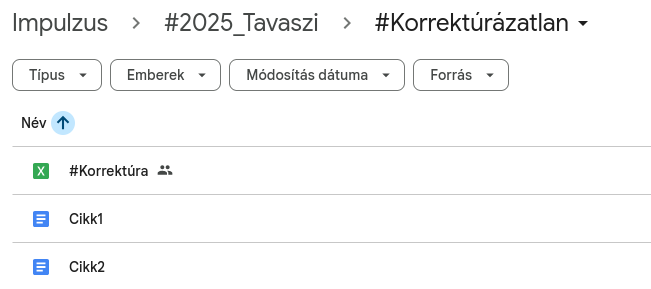
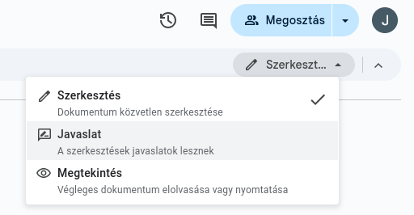

# Folyamat

Amikor beérkezik egy cikk, azt mindig a cikk írója/felelőse jelzi a "korrektor" Discord-csatornán. A cikk ezzel bekerült a megfelelő
Korrektúrázatlan mappába, valamint a #Korrektúra táblázatba is egy új sorként.

Amikor egy cikket elkezdesz korrektúrázni, írd be a táblázatba a megfelelő oszlopba és sorba
a nevedet, a dátum helyére pedig ideiglenesen egy „most”-ot, amíg nem végzel a
korrektúrázással. Ha végeztél, írd be az aznapi dátumot.

!!! tip "Dátum beszúrása"
    A mai dátumot a ++ctrl+"é"++ billentyűkombinációval tudod beszúrni.

A korrektúrázatlan mappából válaszd ki a cikket! (A táblázatba írt címnek elvileg meg kell
egyeznie a dokumentum nevével.)

!!! warning "Javaslat mód"
    **Csak Suggesting / Javaslat módban tegyél minden módosítást!**

Ha nem ez van kijelölve, akkor a menüsorban balról a második ikonnal vagy a View (Nézet)
Mode (Mód) opciót kiválasztva tudsz váltani az Editing (Szerkesztés), Suggesting
(Javaslat) és a Viewing (Megtekintés) módok között. Ennek a kiválasztásnak egy egyszerűbb módja jobb felül
a Share (Megosztás) gomb alatti legördülő menü.

Valószínűleg ezt minden egyes cikk esetén külön be kell állítani majd. Onnan tudod, hogy véleményezés módban vagy, hogy
ha módosítani próbálsz, akkor az más színnel jelenik meg és lehetőség van annak
elfogadására vagy elutasítására.

Ezt követően lehetőség van magára a korrektúrázásra, a hibák javítására. Ha valami nem
szépen van megfogalmazva, de nem tudsz rá rögtön jobb megfogalmazást, nyugodtan jelöld
megjegyzésben.

Előfordulhat, hogy nem értesz egyet az előző korrektor javításával. Bátran felülírhatod (nem elutasítod!) az ő javaslatát, vagy jelezheted nemtetszésed egy kommenttel.

!!! tip "Kommentek tördelőknek"
    A korrektúrázásban kommenttel gyakran jelölünk a tördelőknek hasznos információt (pl. itt egy webcím, az legyen dőlt). Ezeket a kommenteket semmiképp se tüntesd el!

Egy cikket általában három korrektor néz át, és egy tapasztaltabb korrektor fogadja el az
egyes módosítási javaslatokat.

!!! danger "Harmadik korrektor"
    A harmadik korrektor feladata, hogy a korrektúrázás végeztével jelezze az író számára, hogy elkészült a három korrektúra a cikkjén. Ez történhet akár a Discordon, akár e-mailben, vagy tetszőleges egyéb kommunikációs csatornán. Miután az író jóváhagyta, fel kell vezetni a táblázatba a megfelelő rublikába, dátummal ellátva.