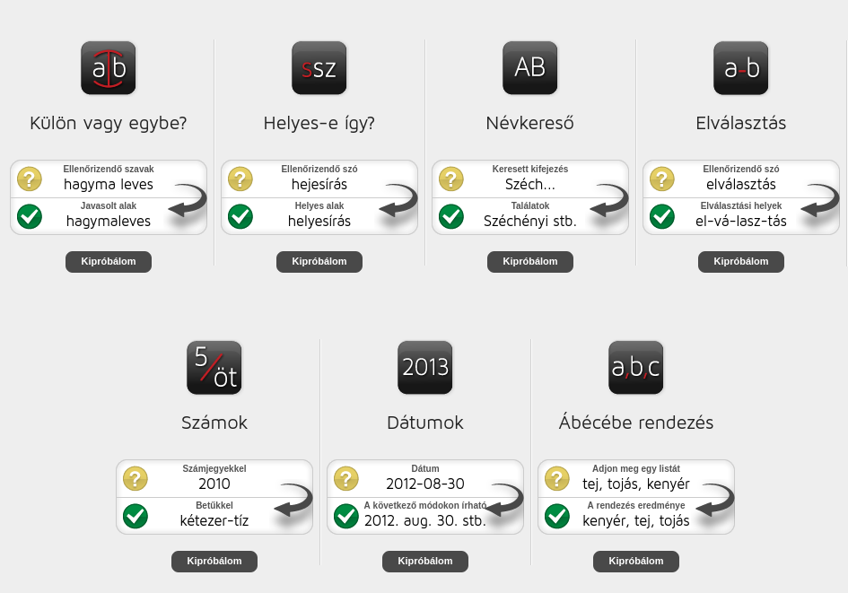

# Helyesírás

"Minek előtte tökéletesen megvizsgált nagy grammatikát bocsátana ki a' magyar tudós Társaság, a' helyesírásra 's a' nyelv' paradigmáira nézve kívánt bizonyos főbb szabások felett megegyezni; hogy neve alatt kijövendő évkönyveiben, folyóiratában 's hivatalos jelentéseiben, ha más meg más elmék tünnek is ott elé sajátságaik' jeleivel, az egy erkölcsi test' irása' módja, tétovázó és tarka ne legyen."

\- *Előszó. A Magyar helyesírás' és szóragasztás' főbb szabályai (részlet)*

 

A korrektor fő feladata a helyesírás ellenőrzése. Jelenleg A magyar helyesírás szabályai 12. kiadása szolgál alapvetésként minden magyar nyelven írt szövegnek.

!!! tip "A szabályzat online elérhetősége"
    https://helyesiras.mta.hu/helyesiras/default/akh12

Az MTA oldalának más [hasznos funkciói](https://helyesiras.mta.hu/helyesiras/default/index) is vannak, a következő képen ezeket láthatod.

Hasznos oldal lehet még [a wikipédia gyakori elírások gyűjteménye](https://hu.wikipedia.org/wiki/Wikip%C3%A9dia:Helyes%C3%ADr%C3%A1s/Gyakori_el%C3%ADr%C3%A1sok_list%C3%A1ja).

!!! warning "Vesszők"
    Külön kiemelném még a szabályzatból [a vesszők használatára vonatkozó részeket](https://helyesiras.mta.hu/helyesiras/default/akh12#F9_3), amiket érdemes gyakran átfutni.

Előfordulhat, hogy a szóismétlés elkerülése végett szinonímákra van szükséged, ezeket az [alábbi](https://szinonimaszotar.hu/) oldalon kereshetsz.

Rendkívül fontos az idegen nyelvű szavak helyesírása is, amelyeket az adott nyelv egynyelvű szótáraiban érdemes ellenőrizni. Ezekből a két legtöbbet előforduló az angol és a német.

Angol szótár: https://www.merriam-webster.com/

Német szótár: https://www.duden.de/woerterbuch

